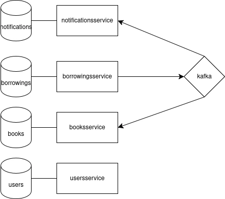

# reskill-java-final

Demo project for the

## Starting up

You will need `docker compose` installed in your machine. 

1. Make sure `notifications.txt` exists at the root of the project.
2. Make sure the following ports are available:
    - 5432: PostgresSQL
    - 9092: Kafka
    - 9093: Kafka
    - 8080: Books Service
    - 8081: Users Service
    - 8082: Borrowings Service
3. Run the following command

```bash
docker compose up
```

That's it!

## Documentation

Architecture diagram:



### Swagger UI

Auto-generated Open API documentation can be found for each project at `/swagger-ui/index.html`.

- [Books Service](http://localhost:8080/swagger-ui/index.html)
- [Users Service](http://localhost:8081/swagger-ui/index.html)
- [Borrowings Service](http://localhost:8082/swagger-ui/index.html)

## Notifications

The notifications are sent to the `notifications.txt` file at the root of the project.
Listen for notifications using the following command:

```bash
tail -f notifications.txt
```
